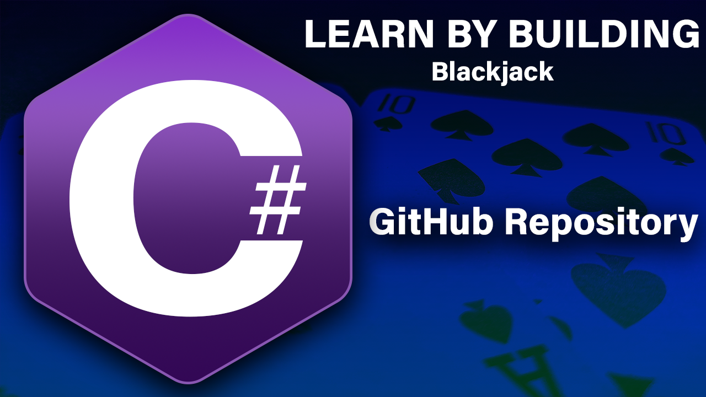

# BlackjackLight

<!-- PROJECT LOGO -->
<br />
<p align="center">
  <a href="https://github.com/DeveloperJourneyEK/BlackjackLight">
    
  </a>

  <h3 align="center">Learn C# By Building - Blackjack The Card game</h3>

  <p align="center">
    Repository contains Blackjack the card game in a C# Console Application form which you can freely 
    <br />
    <br />
    <a href="https://www.youtube.com/watch?v=r0KTuGn-nhw&list=PLBT4d1188Q3sEyYZxTfunthVr1GvLpBeK">Link to C# Tutorial series playlist</a>
    ·
    <a href="https://github.com/DeveloperJourneyEK/BlackjackLight/issues">Report Bug</a>
    ·
    <a href="https://github.com/DeveloperJourneyEK/BlackjackLight/issues">Request Feature</a>
  </p>
</p>


<!-- TABLE OF CONTENTS -->
<details open="open">
  <summary>Table of Contents</summary>
  <ol>
    <li>
      <a href="#about-the-project">About The Project</a>
      <ul>
        <li><a href="#built-with">Built With</a></li>
      </ul>
    </li>
    <li>
      <a href="#getting-started">Getting Started</a>
      <ul>
        <li><a href="#prerequisites">Prerequisites</a></li>
        <li><a href="#installation">Installation</a></li>
      </ul>
    </li>
  </ol>
</details>


<!-- ABOUT THE PROJECT -->
## About The Project

This repository is created in respect to Youtube C# Tutorial series - Learn C# By Building - Blackjack The Card game
<a href="https://www.youtube.com/watch?v=r0KTuGn-nhw&list=PLBT4d1188Q3sEyYZxTfunthVr1GvLpBeK">Link to the series playlist</a>


### Built With

* [C# Console Application] - https://docs.microsoft.com/en-us/visualstudio/get-started/csharp/tutorial-console?view=vs-2019


<!-- GETTING STARTED -->
## Getting Started

To get started follow the steps below.

### Prerequisites

Install an IDE follow the tutorials:
<ul>
<li><a href="https://www.youtube.com/watch?v=So-QLydY4M8">Setting up Visual Studio 2019</a></li>
<li><a href="https://www.youtube.com/watch?v=s4tTKkXNiKY">Setting up Visual Studio Code</a></li>
</ul>

Or just download any IDE applicable to your operating system:
<ul>
<li><a href="https://visualstudio.microsoft.com/downloads/">Visual Studio download page</a></li>
<li><a href="https://code.visualstudio.com/download">Visual Studio Code doownload page</a></li>
<li><a href="https://www.sublimetext.com/">Sublime Text download page</a></li>
<li><a href="https://atom.io/">Atom doownload page</a></li>
<li><a href="https://notepad-plus-plus.org/downloads/">Notepad++ doownload page</a></li>
</ul>


### Installation

1. Clone the repo
   ```sh
   git clone https://github.com/your_username_/Project-Name.git
   ```
2. If you want to follow from a specific branch
   ```sh
   git fetch
   git checkout <existing_branch>
   ```
3. Rebuild and execute the project
